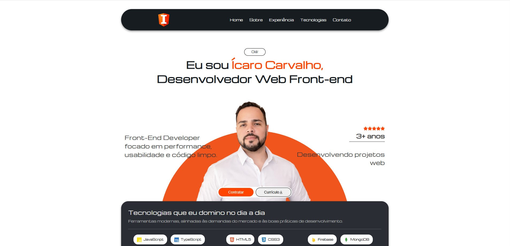

<p align="center">
  
</p>
<hr>
<!--  -->

# Portfólio - Ícaro Carvalho

[](https://devicarocarvalho.web.app/)
[](https://devicarocarvalho.web.app/)

Portfólio profissional desenvolvido com foco em organização de código, componentização e performance.  
Projeto criado com o objetivo de apresentar minhas habilidades técnicas como Desenvolvedor Front-end e apoiar minha busca por oportunidade CLT.

---

## Acesse o Projeto

Produção:  
https://devicarocarvalho.web.app/

Repositório:  
https://github.com/icarovscarvalho/newPortolio

---

## Tecnologias Utilizadas


---

## Principais Características

- Estrutura baseada em componentes reutilizáveis
- Separação clara de responsabilidades por pastas
- Carrossel desenvolvido manualmente
- Accordion desenvolvido manualmente
- SEO configurado
- Responsivo (mobile-first)
- Deploy via Firebase Hosting

---

## Estrutura do Projeto

Arquitetura organizada por domínio de responsabilidade, facilitando manutenção e escalabilidade:</br>
src/</br>
├── assets/</br>
├── components/</br>
│ ├── about/</br>
│ ├── accordion/</br>
│ ├── carousel/</br>
│ ├── footer/</br>
│ ├── header/</br>
│ ├── hero/</br>
│ ├── hireMeBtn/</br>
│ ├── hooks/</br>
│ ├── skills/</br>
│ └── worksExp/</br>
├── App.tsx</br>
└── main.tsx</br>


Essa organização permite localizar rapidamente cada parte da aplicação, mantendo o projeto previsível e escalável.

---

## Decisões Técnicas

### Vite
Escolhido por oferecer ambiente de desenvolvimento mais rápido e gerar builds mais leves para deploy.

### React (SPA)
O projeto não exigia SSR, portanto a abordagem SPA foi suficiente e mais simples para o contexto.

### CSS Modules
Inicialmente o projeto utilizaria Tailwind, porém como houve inconsistências no funcionamento, optei por CSS Modules para manter maior controle sobre os estilos e evitar complexidade desnecessária.

### Arquitetura por Componentes
A divisão em pastas específicas para cada funcionalidade facilita manutenção, leitura e evolução do código.

---

## Projetos Apresentados

- **LemonPop** (Repositório público)
- **Saúde Integral do Homem** (Projeto em produção)
- **Bloodhound RPG** (Projeto em produção)

Todos os projetos apresentados foram desenvolvidos como Front-end.

---

## Como Executar Localmente

```bash
# Clone o repositório
git clone https://github.com/icarovscarvalho/newPortolio.git

# Acesse a pasta
cd newPortolio

# Instale as dependências
npm install

# Execute o projeto
npm run dev
